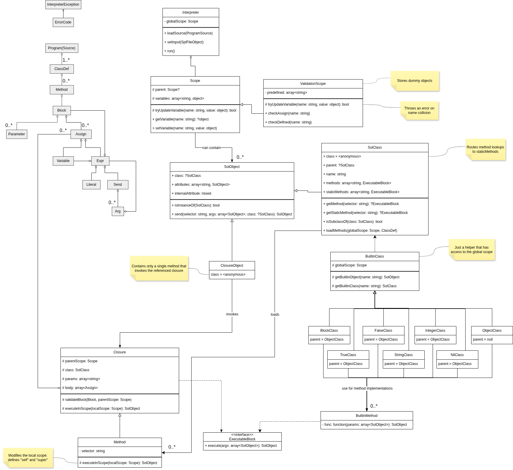

# IPP project 2026

This is an interpreter of the SOL26 programming language.

## How this works

The interpreter performs basic static analysis upon loading the program source
in several stages. The analysis includes class definition validation (which is
independent on the order of definition), recursive inheritance detection,
scope validation (that handles undefined variables and parameter collision),
and duplicate method definition detection.

Validation of variable definitions and parameter collisions is notable because
of `ValidationScope`. It is a subclass of `Scope` that does not store
`SolObject`s but only dummy values &mdash; there are no actual objects
during validation.

Loaded classes are stored as normal objects in the global scope.
Method bodies are represented as arrays of raw assignment AST structures
(due to the simplicity of the language they can be executed directly).

Classes are implemented as first-class objects to simplify message sending.
Class methods are implemented as internal static methods, which are
inherited (even though they cannot be defined in the current version of SOL).

## Classes

*Note: `InputModel\Program` is referred to as `ProgramSource`.*

- `Program`: loads the classes, validates the toplevel structure, sets the
    input file stream, and runs the `Main::run` method.
- `Scope`: an abstract data type for symbol lookup.
- `ValidationScope`: a specialization of `Scope` that has validation (`check..`)
    functions that throw errors for invalid variable assignments or when
    variables are not defined.
- `SolObject`: a root class for all SOL objects. Handles message sending logic,
    including "does not understand" error handling, and the `class` parameter
    that can provide a message context: for `self` the interpreter will use
    the current class, for `super` it will use the parent class.

    The internal attribute is defined in the root class
    to simplify object copy implementation.

    Note that the nullable `class` is intentional: internal anonymous proxy
    classes that serve as classes for classes themselves have this attribute set
    to `null`.
- `SolClass`: a subclass of `SolObject`, the `class` attribute of `SolClass`
    is an anonymous proxy class that redirects method lookups to
    `staticMethods`.
- `Closure`: represents any kind of SOL block; executes actual program code.
    Captures the surrounding (`parent`) scope, but executes the code in a local
    scope that is modifiable by derived classes.
- `Method`: a specialization of `Closure` that just adds method semantics:
    has a custom selector, and defines `self` and `super` in the local scope
    when executing code. This is what classes load from source.
- `ClosureObject`: created at runtime when evaluating block literals.
    To be able to respond to a `value...` message, each `ClosureObject` uses
    an anonymous class that has a method with the message selector and forwards
    the call to an internal `Closure` that represents the block code.
- `ExecutableBlock`: allows using both `Closure`s (program code) and
    `BuiltinMethod`s as method bodies.
- `BuiltinClass`: just a helper that references the global scope.
    This is crucial for retrieving the `true`, `false`, `nil` objects and other
    classes.
- `BuiltinMethod`: wraps any PHP function into a SOL method.
- `ObjectClass`, `NilClass`, `TrueClass`, `FalseClass`, `StringClass`,
    `IntegerClass`, `BlockClass`: the built-in classes.
    `IntegerClass` and `StringClass` create distinct objects for each literal,
    while `TrueClass`, `FalseClass`, and `NilClass` return the same object
    retrieved from the global scope as per the specification.

## OOP patterns used

- **Singleton:** aside from the required `true`, `false`, and `nil` singletons,
    all built-in classes are also implemented singleton objects, which allows
    for e.g. the `String` class to receive its input stream as a private,
    interpreter-visible attribute.

- **Template method:**
    + `Closure::executeInScope` allows `Method::executeInScope` to
        define `self` and `super`
    + `Scope::tryUpdateVariable` allows `ValidationScope::tryUpdateVariable`
        to add validation to the operation

- **Proxy:** used to wrap `SolClass` into a proxy that translates method lookups
    into static method lookups on the original `SolClass` object.
    This allows treating classes as first-class objects and implementing
    static methods.

- **Adaptor:** `ClosureObject` adapts an internal `Closure` to act as a
    `SolObject`, which allows for splitting the generic `Closure`
    (that executes actual SOL code from methods and nested blocks) from
    closure objects (that only apply to nested blocks).

## Problems resolved

- **Problem:** how to distinguish between classes and instances for message
    sending?

    **Solution:** made classes first-class objects so that there is no need to
        distinguish them from class instances.

- **Problem:** if classes are first-class objects, what are their own classes?

    **Solution:** every class as an object has an anonymous metaclass that
        redirects method lookups to the class's `staticMethods`.

- **Problem:** how to implement closures?

    **Solution:** split closure logic in two parts: code execution and
    the object wrapper part.
    Code execution is universal among methods and closures and is implemented
    in the `Closure` PHP class.
    The object wrapper part is only relevant for closure objects
    (that have `value:value:...` methods) and is implemented in the
    `ClosureObject` PHP class.

    A closure object is an object of a special anonymous class that inherits
    from the built-in `Block` class and has only one method called `value...`
    that redirects the call to the underlying closure code.

## Changelog

**Version 2:**

- `Dockerfile`:
    + fixed environment setup and code quality tool scripts
- Tester:
    + fixed diffing and test filtering
    + fixed temporary file creation: now using a standard function instead of
        creating a hidden file in the script directory

## Future thoughts

Aside from **extension #5 (classes as first-class objects)** that is already
implemented as an initial design choice, the following extensions could be
easily implemented thanks to the extensible design of the interpreter:

- **extension #1 (exceptions):**
    + classes can be passed as `on:` parameters without any problems;
    + the interpreter already does some exception handling at method boundaries
        in order to print user-friendly stack traces. Implementing the
        `on:do:` mechanism will simply mean extending an already existing
        mechanism;
    + exception type checking can be implemented using the existing
        `SolObject::isInstanceOf` method;
- **extension #2 (interfaces):**
    + the interpreter already processes the source in several passes due to
        recursive inheritance checking, thus adding a new pass to process
        interfaces before class definitions will not be a problem;
    + upon loading a class, verifying that it implements a given list
        of interfaces (which are already processed by the interpreter)
        should be trivial;
- **extension #8 (the `doesNotUnderstand` mechanism):**
    + the whole message sending logic is encapsulated in
        `final SolObject::send`, which already contains DNU handling,
        so adding new DNU logic will just mean modifying this single function.

## AI usage

- [GitHub Copilot](https://github.com/features/copilot):
    + in-editor automatic code completion, all results always reviewed and fixed
        by hand
    + *not used* in agentic or chat mode
- [ChatGPT](https://chatgpt.com) (see [chat history](https://chatgpt.com/share/69d80dfe-71c0-832e-b4f1-c5063ea175f3)):
    + generic PHP & TypeScript questions (language semantics, library functions,
        tool usage)
    + resolving specific coding problems (warnings & errors)
    + naming suggestions (functions & classes)
    + occasional grammar & spelling assistance
